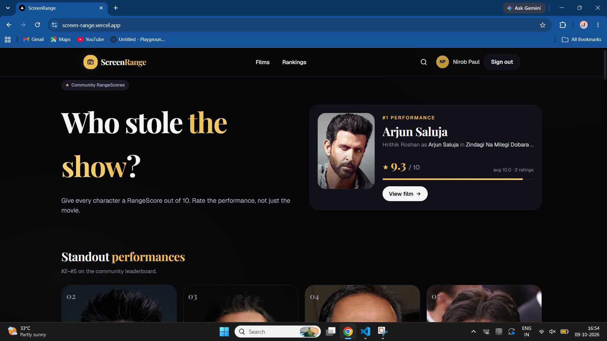
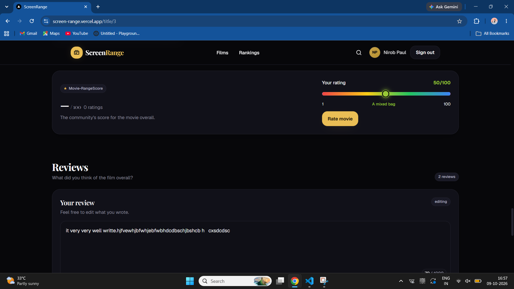
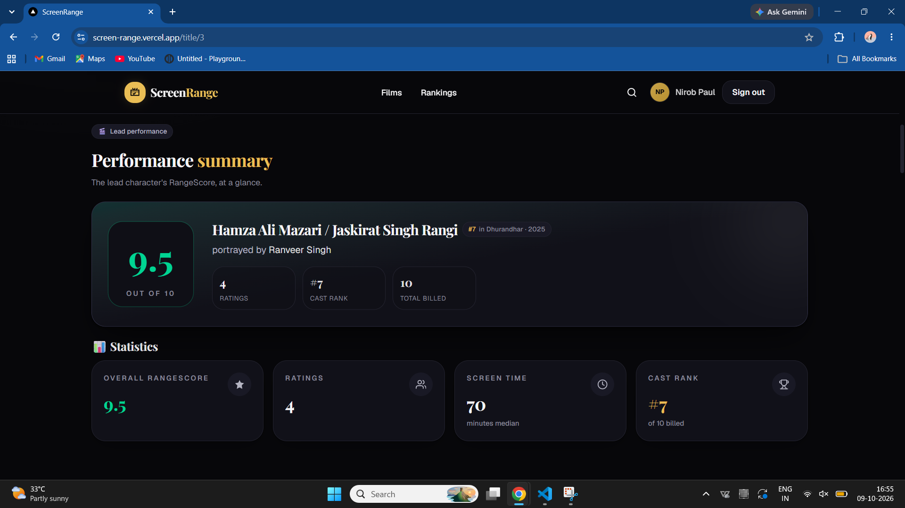
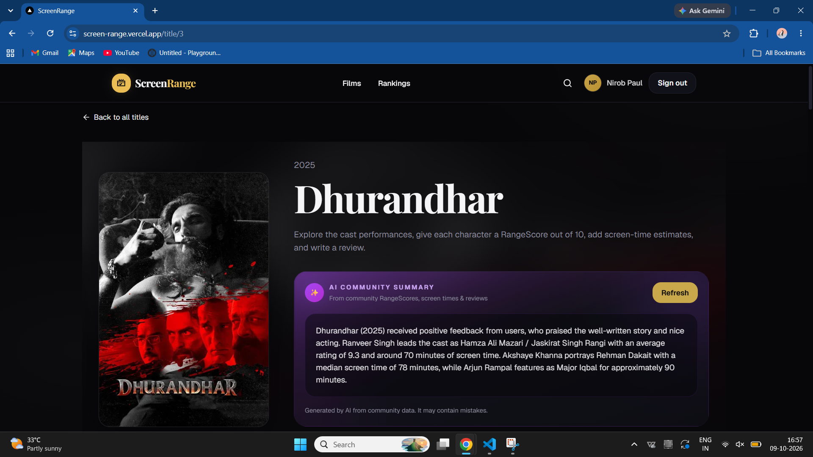
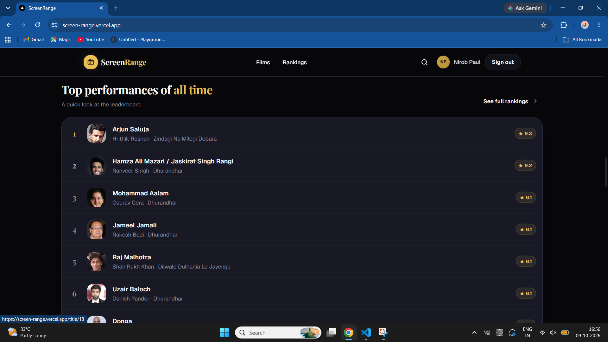

# ScreenRange

**Rate the performance, not just the movie.**

ScreenRange is a community site where people rate individual acting performances, report how long each actor is on screen, and write short film reviews. Every cast member gets their own score for their role, and a leaderboard ranks the best performances of all time.

**Live demo:** https://screen-range.vercel.app
**Source:** https://github.com/Paul-NIROB/ScreenRange



## Screenshots

| Movie Performance Ratings                  | RangeScore                             | AI Summary                            |
| ------------------------------------------ | -------------------------------------- | ------------------------------------- |
|  |  | 

### Character Performance Ratings



## Features

- **Per-role performance ratings:** rate any cast member from 1 to 10 for a specific character. One rating per user per role; rating again updates the old score.
- **Movie-RangeScore:** rate the movie overall from 1 to 100, separately from character performance ratings. One rating per user per movie; rating again updates the old score.
- **Screen-time reports:** users estimate how many minutes an actor appears on screen. The site shows the **median**, so a few joke entries cannot skew it.
- **All-time leaderboard:** top performances ranked with a weighted score (see below).
- **Written reviews:** one review per user per film, showing the reviewer's first name only. Users can edit or delete their own.
- **Search:** find films by title or by actor name. The query lives in the URL, so searches are shareable.
- **AI community summary:** a short summary of a film's ratings, screen times and reviews, written by an LLM from the community's own data.
- **Google sign-in**, a privacy page, custom 404 and error pages, and a mobile-first layout.

## Tech stack

| Area | Technology |
|---|---|
| Framework | Next.js 16 (App Router, Server Components, Server Actions), TypeScript |
| Styling | Tailwind CSS v4 with design tokens in `app/globals.css` |
| Database and auth | Supabase (PostgreSQL, Row Level Security, Google OAuth), `@supabase/ssr` |
| Movie data | TMDB API (seeded into the database by scripts) |
| AI | Google Gemini API (free tier), called only from the server |
| Hosting | Vercel (automatic deploys from GitHub) |

## Engineering highlights

1. **Security lives in the database.** Every table has Row Level Security. Users can read and write only their own ratings, screen-time entries and reviews. The public sees only aggregates, which are served by `SECURITY DEFINER` functions with a fixed `search_path`.
2. **Rules are enforced twice.** Constraints in Postgres (score 1 to 10, minutes 1 to 300, review length 10 to 1000, one row per user per role) plus validation in the server actions.
3. **Fair rankings.** A plain average lets one 10/10 beat fifty ratings averaging 9.2. The leaderboard uses a weighted score, `(v / (v + m)) × R + (m / (v + m)) × C`, where `R` is the role's average, `v` its number of ratings, `m = 3` the confidence threshold and `C` the site-wide average.
4. **Median screen time** via `percentile_cont(0.5)`, which resists outliers.
5. **AI with cost and safety controls.** Login required to trigger a summary; results are cached in Postgres with a SHA-256 fingerprint of the input data, so unchanged data costs nothing; a 10-minute cooldown; the API key stays server-side and is sent in a header, not the URL; review text is treated as untrusted input (angle brackets stripped, wrapped in `<data>` tags, with instructions to ignore commands inside it); friendly handling of rate limits (HTTP 429); the model name is an environment variable so a retired model needs no code change.
6. **Auth done properly.** Cookie-based sessions with `@supabase/ssr`, a `proxy.ts` that refreshes sessions, server-verified users with `getUser()`, and validation of the post-login redirect path.
7. **Search input is sanitised** before it reaches a database filter.

## Data model

| Table | Purpose |
|---|---|
| `titles` | Films, seeded from TMDB |
| `people` | Actors |
| `cast_roles` | Links an actor to a film and a character |
| `performance_ratings` | One 1 to 10 score per user per cast role |
| `movie_ratings` | One 1 to 100 Movie-RangeScore per user per movie |
| `screen_time_entries` | One minutes estimate per user per cast role |
| `reviews` | One review per user per film |
| `ai_summaries` | Cached AI summary per film |

The full schema, policies and functions are in [`supabase/schema.sql`](supabase/schema.sql).

## Run it locally

1. **Clone and install**

   ```bash
   git clone https://github.com/Paul-NIROB/ScreenRange.git
   cd ScreenRange
   npm install
   ```

2. **Create a Supabase project**, open the SQL Editor, and run `supabase/schema.sql`. For an existing ScreenRange database, apply `supabase/movie_ratings_migration.sql` once instead.
3. **Enable Google sign-in** in Supabase (Authentication, Providers, Google) and add `http://localhost:3000/**` to the redirect URLs.
4. **Create `.env.local`** in the project root:

   ```
   NEXT_PUBLIC_SUPABASE_URL=
   NEXT_PUBLIC_SUPABASE_ANON_KEY=
   SUPABASE_SERVICE_ROLE_KEY=
   TMDB_API_KEY=
   GEMINI_API_KEY=
   GEMINI_MODEL=gemini-3.5-flash-lite
   ```

   `SUPABASE_SERVICE_ROLE_KEY` and `GEMINI_API_KEY` are server-only secrets. Never commit them or prefix them with `NEXT_PUBLIC_`. Set `GEMINI_MODEL` to a model that is currently available to your API key.

5. **Seed the data**

   ```bash
   node --env-file=.env.local scripts/seed.mjs
   node --env-file=.env.local scripts/seed_cast.mjs
   ```

6. **Start the app**

   ```bash
   npm run dev
   ```

   Open http://localhost:3000.

## Roadmap

- Series and anime
- Weekly leaderboard
- Character pages
- Moderation for screen-time reports
- AI-powered natural-language search

## Credits

This product uses the TMDB API but is not endorsed or certified by TMDB.

## Author

Built by **[NIROB PAUL]**. [LinkedIn](https://www.linkedin.com/in/your-profile) · [Email](mailto:Nirobpaulgetit@gmail.com)
